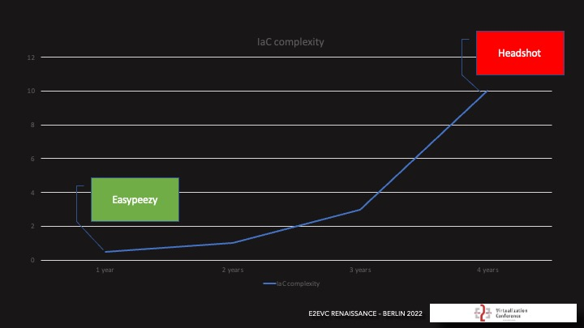
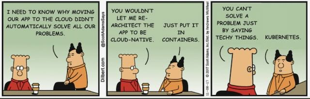

# How to Get Started?

Getting started with automation, especially for infrastructure, involves a structured approach that includes planning,
selecting the right tools, and gradually introducing automated processes. Here’s a step-by-step guide to help you
implement automation effectively:

## Assess Your Current Infrastructure and Processes

While this might seem like an easy task, it can sometimes be the hardest, especially if you're a lone wolf in your IT
department.
If you were involved in the deployment, then you probably know how things were built and what steps were
involved.
However, in larger teams, things may have been built by external staff who are no longer available.
Moreover, documentation is often neglected due to the need to achieve milestones.

It's important to take the first step of clearly understanding your repetitive tasks,
such as server provisioning, configuration updates, or scripts.
This will help you identify areas that can be automated and serve as a good starting point.

## Search for automation opportunities

Consider identifying tasks that are repetitive and can be easily automated using scripts.
Focus on tasks that are prone to errors.
At this stage, don't worry about the programming language or the method you'll use for automation.

Some ideas to help you get started:

- User creation in Active Directory or Entra ID
- VM creation in Azure, Google or AWS
- VM template generation for Azure Virtual desktops
- Creation of automated installation packages for your most used applications
- Hardening your systems based on CIS recommendations
- Adjusting your firewall rules based on the latest threat intelligence

> When you're looking at the opportunities, also have an eye on minification.
> Keep your automation scripts as small as possible to eventually have a library of building blocks, that you can
> dynamically put together for larger scenarios.

Define Objectives: Be clear on what you want to achieve with automation.
This could include reducing deployment times, improving security, increasing scalability,
or ensuring compliance with industry standards.

## Documentation

Having complete documentation is crucial for any project.
If you already have it, you're lucky.
If not, now is the perfect time to start.

Some people believe that scripts and infrastructure as code are sufficient documentation.
However, that's not the case.
Every script and infrastructure component has dependencies that need to be in place, and this information must be
documented thoroughly.

> Your IT manager should be able to implement or run the project without any questions left unanswered.
> This should be your benchmark.

Since many scripts will be stored in a git repository, it makes sense to save the documentation alongside the code.
Markdown language is the best choice for creating new documentation.

> Don't bother with Word documents on SharePoint; they are old-fashioned and inconvenient for this purpose.

## Select Automation Tools and Frameworks

Depending on the opportunities you see to get started, you should familiarize yourself with the different tools and
technologies around your preferred platform, such as:

- Infrastructure as Code (IaC) tools like Terraform, AWS CloudFormation, Azure Resource Manager, OpenTofu or Bicep
- Configuration management tools like PowerShell DSC, Ansible, Puppet, or Chef
- Continuous Integration/Continuous Deployment (CI/CD) pipelines with GitHub Actions, Azure Pipelines, Jenkins,
  GitLab CI/CD, or AWS CodePipeline

> It's always advisable to start with simple solutions when automating tasks.

    As you progress, the complexity will naturally increase.

To get an idea about the available tools and technologies, you can refer to the Cloud Native Landscape.
However, keep in mind that the list can be overwhelming. [Cloud Native Computing Foundation Landscape](https://landscape.cncf.io/)

> Research Available Tools: Depending on your infrastructure (cloud, on-premise, or hybrid), choose automation tools
> that fit your environment.

Popular infrastructure automation tools include:

- Terraform: For provisioning and managing cloud infrastructure as code.
- Ansible: For configuration management and application deployment.
- Jenkins: For automating CI/CD pipelines.
- Kubernetes: For automating containerized application deployments.
- AWS CloudFormation: For automating AWS resource deployments.
- HashiCorp Vault: For automating secrets management and access control.

> If you are using a cloud provider (e.g., AWS, Azure, GCP), leverage their native automation
> frameworks and tools like AWS Lambda, Azure DevOps, or Google Cloud Deployment Manager.
> But always keep in mind that you might want to switch to another cloud provider in the future.

## Start Small with High-Impact Areas

### Pick One Use Case

Start with a small, well-defined project or part of your infrastructure that is straightforward to automate but
provides clear benefits.

> For example, automating the provisioning of test environments or configuring cloud infrastructure.

### Create a Prototype

Develop a proof of concept to ensure that your automation processes work correctly before scaling them across the
organization.

## Implement change management and version control

When starting with the creation of automation scripts, it is important to introduce a version control system right from
the beginning. This holds true even if you are a single person working initially on the project.

You should consider creating a Git repository with a "master" and a "development" branch. This helps you to learn and
practice the process of pulling code from a Git repository, pushing it back and creating a pull request to release it
to the "master" branch. The "development" branch is your development environment, and the "master" branch is your
production environment.

Don't skip this if you plan to implement automation completely in your IT department and environment – this is the
foundation of everything that follows.
Implementation of components like automatic documentation, security scanning of code with linting or the pipelines you
create to deploy your code will rely on the first basic version of control components.

Implementing Git also fosters collaboration as soon as you add more people to the automation initiative and enables more
teams to collaborate. This implementation also encourages knowledge sharing and supports the documentation by adding
operational changes to the complete development and delivery process.

## Implement Infrastructure as Code (IaC)

### Use Version Control

Store infrastructure configuration in version control systems like Git. Tools like Terraform and AWS CloudFormation
allow you to define and manage your infrastructure using code, making it easier to
replicate and track changes.

### Modularize

Break down your infrastructure code into reusable modules or templates. This will make it easier to manage, update, and
scale your automation efforts over time.

## Automate Testing and Validation

### Infrastructure Testing

Before deploying any automated changes to production, ensure that you have automated tests in place. Tools like
Terratest can help you test your infrastructure code.

### CI/CD Pipelines

Integrate your infrastructure code into your CI/CD pipelines using tools like Azure DevOps Pipelines, GitHub Actions, or
Jenkins. This will allow you to automatically test and deploy infrastructure changes in a controlled and repeatable way.

## Monitor and Optimize

### Monitoring and Alerting

Set up monitoring and alerting systems to ensure that automated deployments are working as expected. Use tools like AWS
CloudWatch, Prometheus, or Grafana for real-time monitoring of automated infrastructure.

### Error Handling

Implement automated rollback mechanisms to revert infrastructure changes in case of failures. For example, Terraform has
built-in support for rollbacks if a deployment fails.

## Establish Governance and Security

### Access Control

Define who has access to modify infrastructure automation scripts and restrict permissions where necessary. Use tools
like HashiCorp Vault or AWS IAM for managing secrets and permissions.

### Compliance Automation

Leverage tools like AWS Config, Macie, and GuardDuty to automate compliance checks and security monitoring. This will help
ensure that your infrastructure meets industry standards and regulatory requirements.

## Create Documentation and Training

### Document Processes

Maintain clear documentation for all automated processes, tools, and scripts. This will help ensure that everyone in
your team understands how automation works and can troubleshoot issues when necessary.

### Train Your Team

Invest in training your teams to manage and update the automation systems. Ensure that your team knows how to extend
automation to new use cases, debug failures, and improve existing automation pipelines.

## Gradual Rollout

### Pilot in Non-Production Environments

Begin by automating deployments and processes in test or staging environments. This allows you to test and refine
automation without risking production outages.

### Iterative Rollout

Gradually expand automation to more parts of your infrastructure and business processes. Avoid trying to automate
everything at once, as this can lead to overwhelming complexity.

## Review and Iterate

### Post-Deployment Reviews

After automating processes, review the outcomes. Did automation reduce errors and improve efficiency? Gather feedback
from the team and refine the automation processes as necessary.

### Regular Updates

Keep your automation scripts and tools up to date to align with new technologies, infrastructure changes, and business
requirements.

## Scale Automation

### Expand to Other Use Cases

Once the initial automation efforts have proven successful, look for other areas where automation can be applied.
This could include scaling environments, backups, security patching, or even more advanced use cases like predictive
scaling using AI/ML models.
