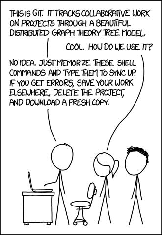

# What Knowledge do I Need?

To get started with automation, you’ll need a mix of foundational knowledge and hands-on skills that cover areas like
infrastructure, scripting, and specific tools. Here’s a breakdown of the essential knowledge you should have:

## Basic Understanding of IT Infrastructure

### Networks and Servers

Understand how servers, networks, and storage work, including virtual machines, containers, and cloud services.
This will help you automate tasks related to resource provisioning, networking, and system management.

### Operating Systems

Be familiar with the operating systems you will be managing (e.g., Linux, Windows). Know how to navigate the file
system, manage processes, configure settings, and troubleshoot issues.

---

## Scripting and Programming

### Basic Scripting Skills

Automation often involves writing scripts to manage infrastructure. Familiarity with scripting languages such as:

- Bash (for Linux environments),
- PowerShell (for Windows environments),
- Python (commonly used for various automation tasks across platforms), is essential.
- YAML: Many automation tools use YAML for configuration files.
- JSON: JSON is another common format for configuration files and API responses.
- HCL: HashiCorp Configuration Language (HCL) is used in tools like Terraform for defining infrastructure as code.
- SQL: If you are working with databases, knowledge of SQL for querying and managing databases is important.
- Regular Expressions: Regular expressions are used for pattern matching and text processing.
- Markdown: Markdown is commonly used for documentation.
- Programming Concepts: Understanding programming concepts like variables, loops, conditionals, functions, and error
  handling will help you write efficient and maintainable automation scripts.
- API Knowledge: Understanding how to interact with APIs is important because many cloud services and automation
  tools expose APIs for managing resources programmatically.

---

## Infrastructure as Code (IaC)

### IaC Concepts and Tools

Learn the principles of Infrastructure as Code, which allows you to define and manage your infrastructure using code.
This helps in making infrastructure deployment more consistent, version-controlled, and repeatable.

#### Terraform

A widely used tool for managing infrastructure across different cloud providers. You should
understand the basic syntax (HCL - HashiCorp Configuration Language), how to write modules, and how to use
providers to interact with cloud resources.

#### Ansible

While Ansible is primarily a configuration management tool, it can also be used for infrastructure
automation. Learn how to define infrastructure tasks using Ansible playbooks.

#### Puppet and Chef

Other configuration management tools that can be used for infrastructure automation. Understanding how to define
infrastructure states using these tools can be beneficial.

#### Desired State Configuration (DSC)

A feature of PowerShell, that can be used to define the desired state of a system and ensure that it remains in that
state.

#### Pulumi

An alternative to Terraform that allows you to define infrastructure using familiar programming languages like Python,
TypeScript, or Go.

#### Bicep

A domain-specific language for defining Azure resources. Bicep simplifies the authoring experience and provides a more
concise syntax compared to ARM templates.

#### ARM Templates

Azure Resource Manager templates allow you to define Azure resources in JSON format. Understanding ARM templates is
essential for automating Azure deployments.

#### Cloud Deployment Manager

Google Cloud Deployment Manager allows you to define Google Cloud resources in YAML or Jinja2 templates. Understanding
Deployment Manager is crucial for automating Google Cloud deployments.

#### CLI Tools

Many cloud providers offer command-line interfaces (CLIs) that allow you to interact with cloud resources. Understanding
how to use these CLIs can help automate tasks and manage resources from the command line.

## Version Control

Since IaC is treated like software code, knowledge of version control tools like Git is essential for tracking changes,
collaborating with teams, and ensuring the reliability of infrastructure deployments.

---

## Orchestration

Orchestration is the automated configuration, coordination, and management of computer systems and software.
Understanding orchestration tools is essential for automating complex workflows and managing distributed systems.

### Kubernetes

If you are managing containerized applications, Kubernetes is crucial for automating the deployment, scaling, and
management of containerized workloads.

### Docker

Understanding how to automate the creation and management of containers using Docker is also critical, especially when
dealing with microservices or modern development environments.

### Nomad

A container orchestration and scheduling tool from HashiCorp. Nomad can be used to automate the deployment and scaling
of applications across a cluster.

### Rancher

A container management platform that can be used to automate the deployment and management of Kubernetes clusters.

---

## Task Automation

Task automation involves automating repetitive tasks to improve efficiency and reduce manual errors.

### Jenkins

An open-source automation server that can be used to automate tasks like building, testing, and deploying infrastructure.

### GitLab CI/CD

GitLab's built-in continuous integration and continuous deployment tool that can be used to automate software delivery
pipelines.

### Azure DevOps Pipelines

Microsoft's cloud-based CI/CD service that can be used to automate the building, testing, and deployment of applications.

### GitHub Actions

GitHub's built-in automation tool that can be used to automate workflows, including CI/CD pipelines.

### Argo Workflows

An open-source container-native workflow engine that can be used to automate complex workflows in Kubernetes.

### Argo CD

An open-source continuous delivery tool for Kubernetes that can be used to automate the deployment of applications.

---

## Secrets Management

### HashiCorp Vault

A tool for managing secrets and protecting sensitive data. Understanding how to use Vault for secrets management is
essential for securing automated deployments.

### AWS Secrets Manager

A service that helps you protect secrets needed to access your applications, services, and IT resources. Understanding
how to use Secrets Manager is crucial for managing secrets in AWS environments.

### Azure Key Vault

A service that helps you safeguard cryptographic keys and other secrets used by cloud applications and services.
Understanding how to use Key Vault is important for managing secrets in Azure environments.

### GCP Secret Manager

A service that helps you securely store and manage API keys, passwords, certificates, and other sensitive data.
Understanding how to use Secret Manager is essential for managing secrets in Google Cloud environments.

---

## Monitoring and Logging

Monitoring and logging tools help you track the performance and health of your infrastructure and applications.

### Prometheus

An open-source monitoring and alerting toolkit that can be used to automate monitoring tasks.

### Grafana

An open-source analytics and monitoring platform that can be used to automate visualization tasks.

### ELK Stack

A combination of Elasticsearch, Logstash, and Kibana that can be used to automate log management and analysis.

---

## Security and Compliance

Security and compliance automation help you enforce security policies and meet regulatory requirements.

### AWS Config

A service that helps you assess, audit, and evaluate the configurations of your AWS resources.
Understanding how to use Config is important for automating compliance checks in AWS environments.

### AWS Macie

A service that helps you discover, classify, and protect sensitive data. Understanding how to use
Macie is important for automating data protection in AWS environments.

### AWS GuardDuty

A service that helps you protect your AWS accounts and workloads. Understanding how to use
GuardDuty is important for automating threat detection in AWS environments.

### Azure Security Center

A service that helps you prevent, detect, and respond to threats. Understanding how to
use Security Center is important for automating security monitoring in Azure environments.

### Azure Policy

A service that helps you enforce organizational standards and assess compliance at scale.
Understanding how to use Policy is important for automating compliance checks in Azure environments.

### Azure Sentinel

A service that helps you collect, detect, investigate, and respond to threats. Understanding
how to use Sentinel is important for automating threat detection and response in Azure environments.

### Google Cloud Security Command Center

A service that helps you view and monitor an inventory of your cloud
assets, scan storage systems for sensitive data, and detect common web vulnerabilities. Understanding how to
use Security Command Center is important for automating security monitoring in Google Cloud environments.

### Open Policy Agent (OPA)

An open-source, general-purpose policy engine that can be used to enforce policies
across the cloud-native stack. Understanding how to use OPA is important for automating policy enforcement
in cloud environments.

---

## Testing and Validation

Automated testing and validation help you ensure that your infrastructure deployments are reliable and secure.

### Terratest

A Go library that can be used to write automated tests for infrastructure code. Understanding how to use Terratest is
important for automating testing and validation of infrastructure deployments.

### Kitchen-Terraform

A test harness tool that can be used to automate the testing of Terraform configurations. Understanding how to use
Kitchen-Terraform is important for automating testing and validation of Terraform code.

### InSpec

An open-source testing framework that can be used to automate compliance testing and security validation. Understanding
how to use InSpec is important for automating testing and validation of infrastructure configurations.

### Serverspec

A Ruby-based testing framework that can be used to automate the testing of server configurations. Understanding how to
use Serverspec is important for automating testing and validation of infrastructure setups.

---

## Soft Skills

There are several soft skills that are essential for success in automation roles.

### Collaboration

Automation often requires cross-team collaboration between development, operations, and security teams. Strong
communication and collaboration skills are essential for ensuring that automated processes align with the needs of
various stakeholders.

### Problem-Solving

Debugging automation scripts and troubleshooting failures are critical skills. You need to think critically and diagnose
issues when automated processes don’t behave as expected.

### Adaptability

The automation landscape is constantly evolving, so being adaptable and willing to learn new tools and technologies is
important for staying current and effective in your role.

### Time Management

Automation can save time and increase efficiency, but it also requires careful planning and organization. Good time
management skills are essential for prioritizing tasks and meeting deadlines in an automated environment.

### Attention to Detail

Automation scripts and processes require precision and accuracy. Attention to detail is crucial for ensuring that
automated tasks are performed correctly and consistently.

### Analytical Thinking

Automation often involves analyzing complex systems and processes to identify areas for improvement.
Analytical thinking skills are important for understanding the underlying logic of automation tasks and optimizing
them for efficiency.

### Creativity

Automation requires creative problem-solving to design efficient and effective solutions. Thinking outside the box and
exploring new approaches can help you develop innovative automation strategies.

### Continuous Learning

The automation landscape is constantly evolving, so a commitment to continuous learning and professional development is
essential for staying current and advancing your skills in automation.

### Leadership

If you are in a leadership role, strong leadership skills are important for guiding your team through automation
initiatives, setting strategic goals, and fostering a culture of innovation and collaboration.

### Emotional Intelligence

Understanding and managing your emotions, as well as those of others, is important for building strong relationships,
resolving conflicts, and fostering a positive work environment in an automated setting.

### Critical Thinking

Automation requires critical thinking skills to evaluate complex problems, identify root causes, and develop effective
solutions. Critical thinking skills are essential for optimizing automated processes and troubleshooting issues.

### Communication

Clear and effective communication is essential for collaborating with team members, documenting automation processes,
and sharing insights with stakeholders. Strong communication skills are important for ensuring that automated tasks are
performed accurately and efficiently.

### Adaptability

The automation landscape is constantly evolving, so being adaptable and open to change is important for staying current
and effective in your role. Adaptability allows you to learn new tools and technologies, embrace new approaches, and
respond to shifting priorities in an automated environment.

### Teamwork

Automation initiatives often require collaboration across teams and departments. Strong teamwork skills are important
for working effectively with others, sharing knowledge, and aligning automation efforts with organizational goals.

---

## Cloud Platforms and Cloud Automation

### Cloud Providers

Familiarize yourself with major cloud platforms like:

- AWS (Amazon Web Services),
- Azure, or
- Google Cloud Platform (GCP).

Each platform has its own automation tools, such as AWS CloudFormation, Azure Automation, or Google Cloud Functions.

---

## Licensing and Compliance

### Licensing

Understand the licensing requirements for the tools and software you use in your automation workflows. Some tools may
have open-source licenses, while others may require commercial licenses.

### Compliance

Ensure that your automation workflows comply with industry regulations and organizational policies. This includes
protecting sensitive data, managing access controls, and auditing automated processes.

---

## On-premises automation

### On-premises Infrastructure

Streamline the tools and processes used to manage on-premises infrastructure and cloud environments.

> You never know if you need to get back to on-premises infrastructure.

You may use tools like:

- Packer: A tool for creating machine images for multiple platforms from a single source configuration.
- Vagrant: A tool for building and managing virtual machine environments in a single workflow.
- Chocolatey: A package manager for Windows that can automate software installations and updates.
- Helm: A package manager for Kubernetes that can automate the deployment of applications and services.

---

> This combination of technical knowledge, tooling, and understanding of best practices will prepare you to successfully
> start automating infrastructure deployments.
