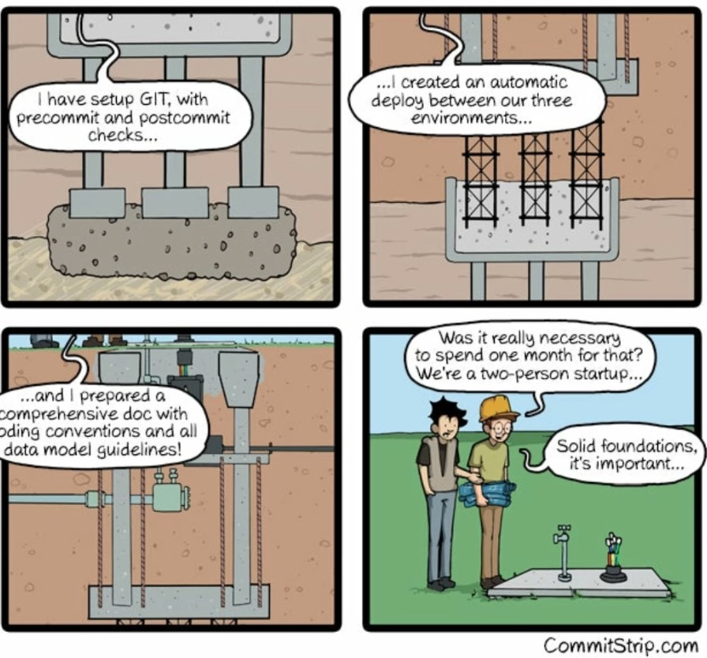

# How to Strategically Start an Automation Project

Starting an automation project strategically involves careful planning, defining clear goals, and aligning with
business goals.

Choosing an infrastructure as code (IaC) deployment strategy will depend on a variety of factors, including the size and
complexity of your infrastructure, the skills and resources available within your team, and the specific requirements of
your organization.

## Scope and scale of infrastructure

Before starting to automate your IT infrastructure with infrastructure as code (IaC), it's important to evaluate your
existing infrastructure to ensure that it's ready for automation.

> If you are managing a small and simple infrastructure, a lightweight deployment tool like Azure CLI or AWS PowerShell
> may be enough.

### Document your current infrastructure

Before you can automate your infrastructure, you need to have a clear understanding of what you currently have in place.
Document your existing infrastructure, including servers, network devices, and applications.

> If you're starting a new project, you can follow a greenfield approach, where you build your infrastructure from scratch.

### Assess your infrastructure's readiness for automation

Evaluate your infrastructure to determine whether it's ready for automation. Factors to consider may include the
complexity of your infrastructure, the level of standardization across your environment, and the level of manual effort
required to manage it.

### Identify areas of improvement

Identify areas of your infrastructure that could benefit from automation, such as repetitive tasks or manual
configuration processes that are prone to error.

### Define your automation goals

Clearly define your goals for automation, including the benefits you hope to achieve and the challenges you hope to
overcome.

### Choose the right IaC tool

Choose an IaC tool that meets your organization's specific needs and can help you achieve your automation goals.
Consider factors such as ease of use, scalability, and integration with other tools in your DevOps toolchain.

### Develop a plan for implementing automation

Develop a plan for how you will implement automation across your infrastructure, including which tasks or processes to
automate first and how you will test and validate your automation workflows.

---

## Familiarity with tooling

Consider the skills and experience of your team members with the various IaC tools available. If your team is already
familiar with a particular tool, it may be easier to stick with that tool rather than introducing a new one.

---

## Support for cloud providers

If you are deploying infrastructure to a specific cloud provider (such as AWS, Azure, or Google Cloud), make sure that
your IaC tool supports that provider.

---

## Integration with other tools

Consider how your IaC tool will integrate with other tools in your DevOps toolchain. For example, if you use Jenkins for
continuous integration, make sure that your IaC tool integrates with Jenkins.

https://landscape.cncf.io/

---

## Cost

Evaluate the cost of the IaC tool, including any licensing fees or restrictions and ongoing support costs or risks
related to vendor lock-in.

---

## Define the layers of your infrastructure

Consider the layers of your infrastructure that you need to manage, such as networking, compute, storage, and security.

### Image Management

Consider how you will manage images and templates for your infrastructure, including versioning, distribution,
and updates.

### Platform Management

Consider how you will manage the platform layer of your infrastructure, including operating systems, middleware,
and runtime environments.

### Configuration Management

Consider how you will manage configuration settings for your infrastructure, including application settings, security
policies, and compliance requirements.

### Application Management

Consider how you will manage applications and services running on your infrastructure, including deployment, scaling,
and monitoring.

---

## Deployment Strategy

### Ensure that your infrastructure is version controlled

Implement version control for your infrastructure to enable collaboration, track changes, and revert to previous
versions if necessary.

> Version control is a key aspect of infrastructure as code (IaC) and enables you to manage changes to your infrastructure
> over time.

### Define and enforce infrastructure standards

Establish infrastructure standards that all automation workflows must adhere to, such as naming conventions, security
requirements, and configuration standards.

> Define and enforce infrastructure standards to ensure consistency and compliance across your environment.

---

## Implement testing and validation

Develop testing and validation processes to ensure that your automation workflows are functioning as intended and meet
your organization's requirements.

> At one point in your journey, you will have to test your code. This is the foundation of a robust automation project.

---

## Establish monitoring and alerting

Implement monitoring and alerting to ensure that your infrastructure remains available and responsive after automation,
and to identify and address issues before they become critical.

> Monitoring and alerting are essential parts of a successful automation project. Without data, you won't be able to
> improve your automation workflows.

---

## Define Deployment Processes

A Deployment process for infrastructure as code (IaC) should follow best practices for continuous delivery and should
involve the following steps:

### Version control

Store your IaC code in a version control system, such as Git.

> This enables you to track changes, collaborate with others, and revert to previous versions if necessary.

### Provision infrastructure

Run your IaC code to provision infrastructure resources, such as virtual machines, networks, and storage, in your cloud
environment.

### Configure infrastructure

Use a configuration management tool, such as DSC, Ansible or Chef, to configure your infrastructure.

> This involves specifying the desired state of your infrastructure, and the configuration management tool will ensure
> that your infrastructure matches this state.

### Test infrastructure

After provisioning and configuring your infrastructure, run integration tests to ensure that your infrastructure is
functioning correctly.

> Testing your infrastructure is essential to ensure that it meets your requirements and is ready for deployment.
> At one point, nobody will be able to check changes manually.

### Deploy application

Deploy your application to the provisioned infrastructure using a continuous integration/continuous deployment (CI/CD)
tool, such as GitHub Actions or azure DevOps pipelines.

> This involves packaging your application, deploying it to the infrastructure, and validating that it is working as
> expected.

### Monitor and troubleshoot

Monitor your infrastructure and application to ensure that they are functioning correctly.

> Use logging and monitoring tools, such as Prometheus or ELK, to identify and troubleshoot issues.

### Rollback and versioning

If necessary, rollback your deployment to a previous version.

> This is made possible by version control and ensures that you can revert to a previous version in case of issues.

"This includes more than just the code. It also includes infrastructure, configuration, and deployment processes,
backup concepts and much more."

https://www.harness.io/blog/blue-green-canary-deployment-strategies
