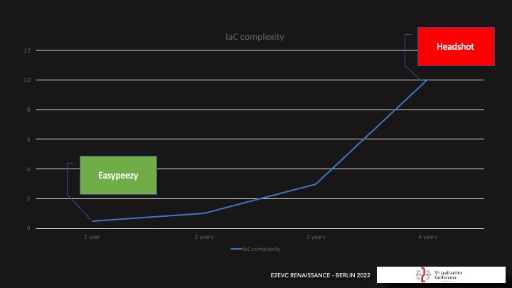

# How to Design Code and Guidelines

Designing code effectively involves more than just writing syntax that works. It requires thoughtful planning,
structuring, and organizing of code to ensure it is maintainable, scalable, and adaptable for future changes.

## Key Aspects to Consider

> Don't overcomplicate the design. Keep it simple and easy to understand.

> Add only parameters you really need. Otherwise, it will be a PITA to troubleshoot and test.

> Define allowed values and standard parameters whenever possible and necessary.

## Clarify the Problem

Before writing any code, make sure you fully understand the problem you’re solving.

---

## Break Down the Problem

Break the overall problem into smaller, manageable tasks or components.

**Example:**

### The Expectation

### The start with one module

People tend to throw everything into one file. Don't do that. Spaghetti code is hard to maintain and troubleshoot.

### Writing multiple modules

Keep the modules small (max 200 resources) for faster deployments and smaller impact if something goes wrong.

## Brick principle

Organize your code into distinct modules or layers, each responsible for a specific concern (e.g., user interface,
business logic, data access). This makes the codebase easier to maintain and test.

> Create modules and Stacks. Don't put everything in one file.

### Dependencies on other modules

### Adding versioning to modules

Building Stacks with Modules

### Adding supporting technologies

### The "final" result

### DRY Principle

Don’t Repeat Yourself – avoid duplicating logic by centralizing common functionality into reusable modules or functions.

> No hardcoding. Use variables and parameters.

If Terraform is not enough, look at https://github.com/gruntwork-io/terragrunt.

### The Journey

---

## Code structure

### Repositories

Repositories are the central place where developers store, version control, and manage their source code.

> This is typically done using Git-based systems like GitHub, GitLab, Bitbucket, or Azure Repos.

### Branching

Branching strategies like **GitFlow** or **GitHub Flow** help manage different code versions, allowing developers
to work on features, bug fixes, or releases independently.

[Github flow vs GitFlow](https://medium.com/@yanminthwin/understanding-github-flow-and-git-flow-957bc6e12220)

### Versioning

Versioning the codebase helps track changes, collaborate with others, and revert to previous versions if necessary.

https://semver.org/

### Commit Conventions

Conventional commits are a standardized way to structure commit messages, making it easier to understand the changes made
to the codebase.

https://www.conventionalcommits.org/en/v1.0.0/

https://gist.github.com/qoomon/5dfcdf8eec66a051ecd85625518cfd13

### Code Review

Code reviews are essential for maintaining code quality and consistency.

> They help catch bugs, improve code readability, and ensure that best practices are followed as well as educating the
> team.

### Pull Requests

Pull requests are a way to propose changes to the codebase. They allow team members to review, discuss, and approve the
changes before merging them into the master branch.

https://docs.github.com/en/pull-requests/collaborating-with-pull-requests/getting-started/best-practices-for-pull-requests

If you are working with Terraform, look at https://www.runatlantis.io/ for Pull Request Automation.

> The master branch should always be protected.

> The requester should not be the approver.

### Tags

Tags are used to mark specific points in the codebase, such as releases or milestones. They help track changes and
identify important versions of the code.

https://www.freecodecamp.org/news/git-tag-explained-how-to-add-remove/

### Releases

Releases are versions of the codebase that are ready for deployment. They are typically tagged in the repository and
include a changelog to document the changes made in that release.

https://docs.github.com/en/repositories/releasing-projects-on-github/managing-releases-in-a-repository

### Linting

Linters are tools that analyze code for potential errors, style violations, and other issues. They help maintain code
quality and consistency across the codebase.

https://github.com/oxsecurity/megalinter

### Pre-commit hooks

Pre-commit hooks are scripts that run before a commit is made. They can be used to enforce coding standards, run tests,
or perform other checks to ensure that the code meets the required quality criteria.

https://pre-commit.com/

### Security Scans

Automated security scans can help identify vulnerabilities, misconfigurations, or insecure code in the codebase. Use dependabot
to keep your dependencies up to date.

https://github.com/dependabot

### Documentation

Documentation is essential for understanding the codebase, its components, and how to use them.

https://www.markdownguide.org/

https://www.markdownguide.org/cheat-sheet/

#### UML Diagrams

Use Unified Modeling Language (UML) diagrams to visualize the relationships between components, classes, and functions.
This can help your team understand the overall structure before diving into the code.

https://mermaid.js.org/#/

#### Terraform Automatic Module Documentation

https://terraform-docs.io/

### Templates

Use templates for common files like READMEs, issue templates, or pull request templates to ensure consistency across
the codebase.

https://docs.github.com/en/communities/setting-up-your-project-for-healthy-contributions/creating-a-default-community-health-file

### Security Practices

Enforce secure coding practices, such as sanitizing inputs, avoiding hardcoded secrets, and following best practices
for authentication and authorization.

Secure your “master” branch and protect it from accidental changes. Define permissions and access controls to ensure
that only authorized users can make changes to the codebase.

### Communication

Effective communication is key to successful collaboration. Use tools like Slack, Microsoft Teams, or Discord to
facilitate communication and keep team members informed.

---

> Automation and Infrastructure-as-Code will keep you busy.

---

> Your code is the single point of truth for your IaC implementation. Take care of it like you would take care of
> your baby.
