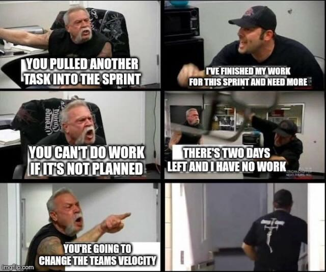

# How to Plan and Work on Automation Projects?

- Define the planning method
- Define the goals and objectives
- Choose the tools
- Create a roadmap
- define standards and conventions
- create feedback loops
- train your team

## Forget Scrum for the Beginning

Scrum is the de-facto standard in software development and infrastructure deployment.

> In the beginning, I wouldn't overcomplicate things for the team until it has grown to a professional size and scale
> where it is crucial to have a rock-solid planning and a person that is taking care of blockers.

Scrum can also create stress inside the team because of its nature.

**Example**

After every sprint in a Scrum iteration, a deployable artifact has to be created. This is base
understanding of Scrum. What if you and your team are miles away from delivering an artifact because something that wasn't
anywhere on your screen planning the sprint happened? You and your team are put into pressure of a guideline that
happens much more often as somebody would think of.

Another thing is the fact that the performance of a team is measured in a value called velocity. Every work item you put
into a sprint gets a value that is defined by the team and that the team often doesn't fully understand. And even for a
Scrum master or a Product Owner, it is hard to explain why something should not be measured in hours or days. So the
team is constantly estimating how long something takes on a base that does not make sense and that is hard to estimate
as well.

> I've seen large development teams struggling with estimation every sprint. And the Scrum master asking for estimations
> for the sake of having them.

Product development and infrastructure automation are two very hard to estimate things. Sometimes things are done on the
first try, and sometimes things escalate very quickly because of multiple dependencies.

> The more I work with Scrum, the more I feel it is in no way suitable for infrastructure deployments or software
> development, especially when you create something completely new. The fact that everybody is doing it does not make it right.

---

We've been running Scrum for more than 5 years now. And we've learned a lot about what works and what doesn't work for
our organization.

## Scrum requires continuous improvement

Scrum is designed to promote continuous improvement, so it is important to regularly reflect on what's working and what
is not working in your Scrum implementation. Don't be afraid to experiment with different approaches and iterate on your
process.

## Communication is key Scrum relies heavily on communication and collaboration between team members. It is important to

create a culture of transparency and open communication, where team members feel comfortable raising concerns and
providing feedback.

## Embrace change

Scrum is designed to be flexible and adaptable, so don't be afraid to embrace change as circumstances evolve. Be willing
to pivot your team's priorities and adapt your process as needed to stay aligned with your goals.

## Invest in your team

Scrum is only as effective as the team that is implementing it. Make sure to invest in your team's growth and
development, both individually and as a group. Encourage ongoing learning, provide opportunities for skill-building, and
create a culture of continuous improvement.

## Don't make it too big

Teams should be small enough to be agile and flexible, but large enough to have the necessary skills and expertise to
and the bigger the team, the harder it is to manage and coordinate.

## Foster a culture of accountability

Scrum relies on team members taking ownership of their work and being accountable for their commitments. Make sure that
your team has a shared understanding of what's expected of them, and create a culture where team members hold each other
accountable for meeting those expectations.

## Focus on outcomes, not outputs

Scrum is focused on delivering value to the customer, so make sure that your team is focused on outcomes, not just
outputs. Encourage your team to think about the impact of their work and how it contributes to the overall goals of the
project.

## Knowledge sharing is key

Scrum is designed to be a collaborative process, so make sure that your team is sharing knowledge and expertise with each
other. Encourage team members to pair program, conduct code reviews, and share best practices to help each other grow and
improve.

## Remote teams are a challenge

Scrum is designed to be a highly collaborative process, which can be challenging when team members are working remotely.
Make sure to invest in tools and processes that support remote collaboration, and create opportunities for team members
to connect and communicate effectively, even when they are not in the same physical location.

## Strict guidelines are sometimes necessary

While Scrum is designed to be flexible and adaptable, there are times when strict guidelines are necessary to ensure that
the team stays on track. Make sure to establish clear boundaries and expectations for your team, and provide guidance and
support when needed.

## Celebrate successes

Scrum can be a demanding process, so it's important to celebrate your team's successes and milestones along the way.
Recognize and reward team members for their hard work and achievements, and create a culture of appreciation and
gratitude.

## Planning and executing

Scrum is a powerful framework for product development, but it requires careful planning and execution to be successful.

## Can happen sometimes...

> Sometimes things seem simpler than they are.

## Many peoople think they are doing agile...

> But in reality, they are not.

## Scrum masters and product owners suffer a lot...

> Not a job for everybody. Scrum masters and product owners have to deal with a lot of stress and pressure.

## Estimations with developers are hard...

> Don't take estimations for granted. They are often wrong.
