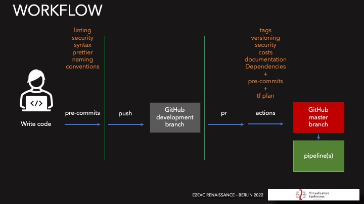

# What Are the Components of a Complete Pipeline?

> A complete CI/CD pipeline automates the process of building, testing, and deploying code, ensuring that software
> development is streamlined, efficient, and reliable.
> It also allows teams to continuously integrate and deliver new features while maintaining high-quality standards.

Besides that, it integrates into the communication and collaboration tools, monitoring and logging, security and
compliance, and automated testing.

> A stable pipeline can only be achieved by running the pipeline on a central server or service.

> The pipeline runs the changes, not the developers.

> The pipeline is run on an everyday basis, to ensure that the pipeline is working.

> Only the pipeline can deploy changes to the production environment.

> The pipeline is the only source of truth for the deployment process.

> The pipeline itself is code and should be treated as such.

> Pipelines will fail because of network issues, not because of the pipeline itself.

> Pipelines will run into timeouts because of network issues or things taking too long.

> Pipelines will fail because of rate limits on the API.

> Pipelines will fail because of the API being down.

> Pipelines will fail because of the API being updated.

> If your repository is unavailable, the pipeline will fail. And Github fails a lot.

> Pipelines will fail because of provider changes.

> Pipelines will fail because developers are the worst testers.

> Pipelines will fail because of the lack of testing.

> Pipelines will fail because even 4 eyes are not enough to catch all the bugs.

> Pipeline management is a full-time job.

---

## Essential Components of a Complete CI/CD Pipeline

Here are the essential parts of a complete CI/CD pipeline:

## Source Code Management (SCM)

### Repository

A centralized place where developers store, version control, and manage their source code.

### Branching Strategy

A well-defined branching strategy (e.g., GitFlow or GitHub Flow) helps manage different code versions,
allowing developers to work on features, bug fixes, or releases independently.

### Triggers

The pipeline is often triggered when code is pushed or merged into certain branches (e.g., main or develop), ensuring
the pipeline runs with every update to the codebase.

**Example**

When a pull request is merged into the main branch, the CI/CD pipeline is triggered to build, test, and deploy
the new code.

## Infrastructure Automation

### Provisioning

Automate the provisioning of infrastructure resources (e.g., virtual machines, networks, databases) using tools like
Terraform, AWS CloudFormation, or Ansible.

### Configuration Management

Use configuration management tools like DSC, Chef, or Ansible to configure and manage infrastructure resources
consistently.

### Deployment Automation

Automate the deployment of applications and services to infrastructure resources.

**Example**

After provisioning a new EC2 instance using Terraform, DSC is used to configure the instance with the necessary
software and settings.

## Automated Testing

### Infrastructure tests

Automated tests to validate the infrastructure configuration and ensure it meets the desired state.

**Example**

Using Terratest to write and run automated tests to validate the infrastructure configuration defined in Terraform.

## Security Checks

### Security Scans

Automated tools scan the code for vulnerabilities such as hardcoded secrets, outdated dependencies, or known security
issues (e.g., Snyk, Dependabot, OWASP Dependency-Check).

Example: After running unit tests, the pipeline uses SonarQube to check code quality and ensures that no known vulnerabilities are introduced by scanning the dependencies with Snyk.

## Monitoring and Logging

### Real-Time Monitoring

After deployment, the pipeline monitors the application’s performance and health using tools like Prometheus, Grafana,
Datadog, or New Relic. These tools track performance metrics (e.g., CPU, memory usage, response time) and ensure the
application meets SLAs.

### Logging

Logs are captured and centralized using tools like ELK Stack (Elasticsearch, Logstash, Kibana) or Splunk. Monitoring
logs help in identifying issues, errors, and performance bottlenecks post-deployment.

### Alerts

Set up automated alerts to notify teams of errors, crashes, or performance issues through tools like PagerDuty, Slack,
or OpsGenie.

Example: After the application is deployed to production, Prometheus and Grafana monitor system performance, while logs
are sent to ELK Stack for centralized logging and debugging.

## Rollback Mechanism

### Rollback Strategy

The pipeline should include a mechanism to automatically or manually roll back deployments in case of failure or
degraded performance. This could involve reverting to the previous deployment version or stopping the rollout if
something goes wrong.

Example: In case of a failed deployment, the pipeline automatically reverts to the previous Docker image version or
deployment configuration using Kubernetes or AWS CodeDeploy.
