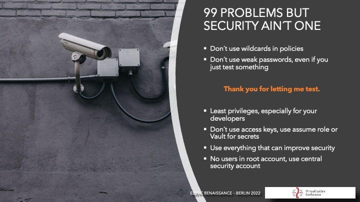
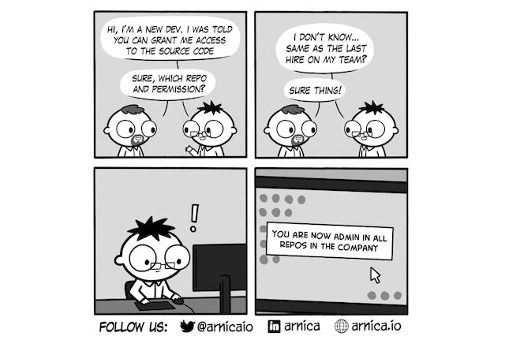

# How to Implement Security?

Implementing security in an automation project requires a holistic approach that encompasses not just the infrastructure
and application but also the tools, processes, and people involved. Here’s a step-by-step guide to ensuring security
is properly integrated at every stage of your automation and deployment process.

## Security by Design

---

### Implement Version Control

Use a version control system (e.g., Git) to manage your codebase, track changes, and collaborate with your team. Tag
releases, branch your codebase, and follow a branching strategy (e.g., GitFlow) to manage different code versions.

> Version Control also needs to be secured. Use access controls and permissions to restrict who can view, commit, or
> merge code changes.

### Least privilege principle

The Least privilege is a security concept that restricts user access rights to only what are strictly required to perform
their job functions. This principle helps reduce the risk of unauthorized access and data breaches.

#### Shift Left Approach

Incorporate security from the very beginning of the project by addressing security in the design phase, rather than
treating it as an afterthought. The shift left approach emphasizes integrating security checks and policies into every
phase of development, from planning through deployment.

#### Threat Modeling

Early on, conduct a threat modeling session to identify potential security risks and attack vectors for your system.
Identify the key assets, potential attackers, attack vectors, and mitigation strategies.

#### Zero Trust Architecture

Implement the zero trust security model where every request—both inside and outside the network—needs to be
authenticated, authorized, and encrypted.

#### Role-Based Access Control (RBAC)

Use RBAC to assign permissions based on roles within the organization or project. Define granular roles for users and
services to minimize the potential attack surface.

#### Multi-Factor Authentication (MFA)

Require MFA for all users accessing sensitive systems, tools, or cloud environments to add an extra layer of security.
Hardware MFA tokens are preferable for critical access.

#### Single Sign-On (SSO)

Implement SSO where feasible to centralize authentication and improve security. This makes it easier to enforce policies
like MFA and reduces the risk of password fatigue or reuse.

> Thank you for letting me test... if you use the default password on a database and have public access enabled.

---

### Use Encryption

At rest and in transit. Period. Encrypt backups, databases, and any other sensitive data to prevent unauthorized access.

---

### Use Security Testing Tools

#### Code Reviews and Static Analysis

Incorporate automated code review tools (e.g., SonarQube, ESLint, Pylint) to perform static code analysis during the
CI/CD pipeline. These tools scan for vulnerabilities, coding standards violations, and common security issues such as
SQL injection or cross-site scripting (XSS).

#### Follow Secure Coding Guidelines

Encourage the use of secure coding practices specific to the languages and frameworks used in your project. For example,
follow OWASP Top 10 guidelines for web applications.

#### Secrets in Code

Avoid hardcoding credentials, API keys, and secrets in your source code or configuration files. Instead, use secrets
management tools (e.g., HashiCorp Vault, AWS Secrets Manager, Azure Key Vault) to store and retrieve sensitive data
securely.

> No weak passwords, even for testing purposes.

### Regular Reviews

Conduct regular security reviews and audits of your codebase, infrastructure, and configurations to identify and address
security vulnerabilities. This can include manual code reviews, penetration testing, and security scanning tools.

### Implement Auditing and Monitoring

Not all compromises are external or easily identifiable. Monitor user activity, system logs, and access patterns to
detect unauthorized access.

> Some compromises like a 2% increase of a production line can go unnoticed for a long time but can heavy impact on the
> production environment.

### Watch Out For Drifts

Monitor your infrastructure for configuration drifts and unauthorized changes. Use tools like AWS Config, Azure Monitor, or
Terraform to track changes and ensure that your infrastructure remains compliant with security policies.

---

## Automated Security Testing

Automate security testing as part of your CI/CD pipeline to identify vulnerabilities early in the development process.

### Dependency Scanning

Regularly scan for vulnerabilities in dependencies using tools like Snyk, Dependabot, or OWASP Dependency-Check to
identify known vulnerabilities in open-source libraries or third-party packages.

### Infrastructure Vulnerability Scanning

Automate infrastructure vulnerability scans (e.g., with AWS Inspector, Azure Security Center) to ensure that the
underlying infrastructure is free from known vulnerabilities.

---

## Automate Security Policies with Infrastructure as Code (IaC)

### Security in Infrastructure as Code

When using Infrastructure as Code tools (e.g., Terraform, CloudFormation, Ansible), ensure that security policies are
baked into the automation scripts. This could include setting up security groups, firewalls, network access controls,
and encryption.

> This is the reason why modules for specific use-cases are the best approach for standardization.

### Security Compliance Automation

Use cloud-native services (e.g., AWS Config, Azure Policy, GCP Forseti) to automatically monitor and enforce compliance
with security best practices across all infrastructures. These services can alert you if policies are violated (e.g., if
an S3 bucket is publicly accessible).

### Automated Auditing

Ensure that all infrastructure changes are tracked and auditable. Leverage tools like AWS CloudTrail or Azure Monitor to
log and monitor changes to infrastructure and configuration.

---

## Monitoring and Incident Response

### Continuous Monitoring

Use monitoring tools (e.g., Prometheus, Grafana, Datadog, AWS CloudWatch) to continuously track the performance and security of applications and infrastructure. Set up alerts for unusual or suspicious
activity.

### Logging and Auditing

Implement centralized logging using tools like ELK Stack (Elasticsearch, Logstash, Kibana), Splunk, or AWS CloudWatch
Logs. Ensure logs are securely stored and available for incident analysis.

### Intrusion Detection/Prevention Systems (IDS/IPS)

Use tools like AWS GuardDuty orAzure Security Center to detect malicious activity and potential threats. Set up
automated responses for certain types of incidents, such as blocking traffic from suspicious IP addresses.

### Incident Response Playbooks

Prepare playbooks for handling security incidents, including detection, containment, eradication, and recovery steps.
Ensure the operations and security teams are familiar with these processes and test them periodically.
