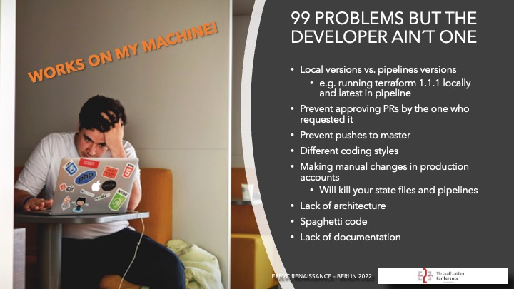
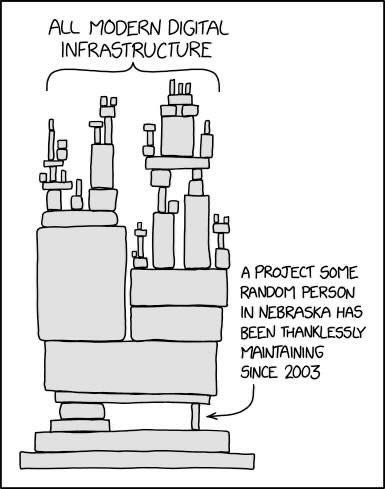

# What to Watch Out For?

When planning and executing an automation project, several potential pitfalls can arise that may undermine your efforts. Here are key things to watch out for and how to mitigate them:

Rate limits: https://learn.microsoft.com/en-us/azure/azure-resource-manager/management/request-limits-and-throttling
https://docs.docker.com/docker-hub/download-rate-limit/

> Don't let your developers develop the same stack on Windows, Mac and Linux without clear guidelines on how to do it.

> NO!!! Manual changes in production environments. This is a no-go. If you have to do it, you have to automate it.

### Scalability and Performance

Take care of rate limits and backoff strategies when designing deployment systems.

> Docker registry rate limits can kill your entire deployment pipeline and infrastructure

## Automating Inefficient Processes

    •	Pitfall: Automating an inherently inefficient or broken process will only replicate the inefficiencies faster. Automation should streamline workflows, not amplify problems.
    •	Mitigation:
    •	Process Optimization First: Before automating, map out and optimize existing workflows to remove bottlenecks, unnecessary steps, or inefficiencies.
    •	Engage Stakeholders: Work with relevant stakeholders to ensure the process is well understood and already functioning optimally.

Example: If a manual process involves unnecessary approvals, automating it won’t help. First, eliminate or streamline the approval process, then automate it.

## Lack of Clear Objectives

    •	Pitfall: Without clearly defined goals, the automation project can drift off course, leading to missed deadlines, unclear outcomes, or even failure.
    •	Mitigation:
    •	SMART Goals: Set Specific, Measurable, Achievable, Relevant, and Time-bound goals for your automation project.
    •	Define KPIs: Identify key performance indicators (KPIs) like time saved, error reduction, or improved scalability to measure the success of the project.

Example: Instead of a vague goal like “improve deployments,” set a goal such as “reduce deployment time by 50% and minimize deployment errors by 75%.”

## Over-Automation

    •	Pitfall: Automating everything indiscriminately can lead to overly complex systems that are difficult to maintain, debug, or adjust.
    •	Mitigation:
    •	Prioritize High-Value Tasks: Focus on automating repetitive, high-impact, and error-prone tasks that offer the greatest ROI.
    •	Start Small: Begin with a manageable pilot project. Ensure it’s working well before expanding automation to other areas.

Example: Automate only the most time-consuming tasks initially, such as infrastructure provisioning, and leave rare, highly nuanced tasks for manual intervention.

## Lack of Proper Error Handling and Monitoring

    •	Pitfall: Automation failures without proper error handling and alerts can lead to downtime, data loss, or unintended consequences. If not monitored, issues can escalate without anyone noticing.
    •	Mitigation:
    •	Error Handling: Ensure robust error handling is built into automation scripts. Automate rollbacks or alert systems when something goes wrong.
    •	Implement Monitoring: Use monitoring tools (e.g., Prometheus, Grafana, AWS CloudWatch) to track automated processes and set up alerts for failure conditions.

Example: Implement automated rollbacks for failed infrastructure deployments and set alerts via AWS CloudWatch or PagerDuty to notify your team if the automation fails.

## Security Risks

    •	Pitfall: Automated processes that manage sensitive data or access systems can introduce security risks, especially if not properly secured.
    •	Mitigation:
    •	Secure Automation: Use encryption, secure credentials management (e.g., HashiCorp Vault, AWS Secrets Manager), and enforce least privilege access policies.
    •	Automated Security Checks: Integrate security checks into your automation pipeline (e.g., static code analysis, vulnerability scans) to catch issues early.

Example: Use HashiCorp Vault to manage API keys and credentials securely and automate vulnerability scanning as part of the CI/CD pipeline.

## Insufficient Testing

    •	Pitfall: Relying on automated scripts without thorough testing can lead to errors in production, causing system outages or data inconsistencies.
    •	Mitigation:
    •	Comprehensive Testing: Test automation scripts in a staging environment using unit tests, integration tests, and end-to-end tests. Ensure scripts handle edge cases correctly.
    •	Test-Driven Development (TDD): Adopt TDD to write tests before writing the automation scripts. This ensures that every script is written to fulfill specific test requirements.

Example: Use Terratest for infrastructure testing to ensure that your Terraform scripts behave as expected before deploying them in production.

## Poor Documentation

    •	Pitfall: Lack of clear documentation can make automated systems difficult to understand, maintain, and scale, particularly when team members change.
    •	Mitigation:
    •	Maintain Up-to-Date Documentation: Document all automated processes, scripts, workflows, and tools in use. Ensure that the documentation is easily accessible and continuously updated.
    •	Code Comments: Include meaningful comments in your automation scripts to clarify the purpose of specific functions or logic.

Example: Create a central repository for automation scripts with clear README files, usage guides, and diagrams to illustrate how automation fits into your larger infrastructure.

## Tool Overload

    •	Pitfall: Using too many different tools for automation can lead to complexity, compatibility issues, and maintenance headaches.
    •	Mitigation:
    •	Consolidate Tools: Choose tools that integrate well with your existing infrastructure and provide flexibility. Avoid using multiple tools for the same task.
    •	Evaluate Long-Term Use: Select tools that are scalable and align with your long-term automation goals to minimize future switching costs or compatibility issues.

Example: Instead of using separate tools for provisioning, configuration management, and monitoring, use a cohesive stack like Terraform (IaC), Ansible (configuration), and Prometheus/Grafana (monitoring).

## Resistance to Change

    •	Pitfall: Teams may resist automation, fearing job displacement, or finding it difficult to adapt to new tools and workflows.
    •	Mitigation:
    •	Involve the Team Early: Engage team members early in the process, explaining the benefits of automation and how it will enhance their roles rather than replace them.
    •	Provide Training: Offer training and resources to help the team become proficient with automation tools and processes.

Example: Host training workshops for the team on Terraform and Jenkins, explaining how these tools can reduce the manual burden and allow them to focus on higher-value tasks.

## Ignoring Continuous Improvement

    •	Pitfall: Automation projects are not “set and forget.” Over time, the tools, infrastructure, and requirements change, and your automation scripts may become outdated or inefficient.
    •	Mitigation:
    •	Regular Audits: Periodically review your automation processes and scripts to ensure they are still relevant and optimized for your current needs.
    •	Iterative Improvements: Implement a feedback loop to gather insights from the team and continuously improve the automation processes.

Example: Schedule quarterly reviews to assess the performance of automation workflows, adjust thresholds, and update scripts to accommodate infrastructure changes.

## Overlooking Scalability

    •	Pitfall: Automation designed for small-scale processes may not work efficiently when scaling up, leading to performance bottlenecks or failures.
    •	Mitigation:
    •	Design for Scalability: Ensure that automation solutions are modular and scalable. Test scripts under different load conditions to ensure they can handle increased usage.
    •	Use Infrastructure as Code (IaC): Tools like Terraform allow you to manage infrastructure in a scalable, version-controlled way.

Example: Ensure that your Terraform modules are designed in a modular way, allowing you to reuse them across environments (e.g., dev, staging, production) as your infrastructure scales.

## Vendor Lock-In

    •	Pitfall: Relying too heavily on one cloud provider or tool can create lock-in, making it harder to switch providers or adopt new technologies in the future.
    •	Mitigation:
    •	Multi-Cloud Strategy: Where possible, design automation scripts that can work across multiple cloud providers (e.g., AWS, Azure, GCP) to avoid being locked into a single platform.
    •	Open Source Tools: Favor open-source or multi-cloud tools to maintain flexibility in your automation approach.

Example: Use Terraform, which supports multiple cloud platforms, rather than being locked into AWS-specific tools like CloudFormation.

Key Takeaways:

    •	Optimize first, automate second: Avoid automating flawed processes.
    •	Start small and iterate: Begin with a pilot project and scale based on feedback and measurable success.
    •	Plan for failure: Build in error handling, logging, and monitoring to ensure you can quickly react to issues.
    •	Security is key: Never overlook securing automation processes, especially when handling sensitive data.
    •	Keep improving: Automation is a dynamic process; continuously evaluate and refine your approach.

There is no Fire and Forget
While infrastructure as code (IaC) has many benefits, there are also several pitfalls that you should be aware of when using IaC to deploy your IT infrastructure. Here are a few common pitfalls to watch out for: 1. Complexity: IaC can be complex, and it can be challenging to design and maintain infrastructure code that is easy to read, understand, and modify. Ensure that your IaC is well-organized and documented. 2. Configuration drift: IaC can help prevent configuration drift, but it is still possible to introduce drift if changes are made outside of the IaC process. Establish processes to ensure that changes are made through the IaC pipeline. 3. Unintended consequences: Changes to infrastructure code can have unintended consequences, such as downtime or security vulnerabilities. Implement testing and validation to ensure that your infrastructure changes are functioning as intended. 4. Tool limitations: IaC tools may have limitations or idiosyncrasies that can cause issues. Ensure that you are familiar with the limitations and capabilities of your chosen IaC tool. 5. Cloud vendor lock-in: Using cloud-specific IaC tools can lead to cloud vendor lock-in. Consider using vendor-neutral IaC tools, such as Ansible or SaltStack. 6. Lack of expertise: IaC requires specific skills and expertise that may not be available in-house. Consider investing in training or hiring experts to ensure that your IaC is designed and maintained effectively. 7. Cost: IaC can require significant upfront investment in terms of time and resources. Be prepared to invest in IaC, but also ensure that you are achieving the expected return on investment.
By being aware of these pitfalls, you can take steps to mitigate the risks associated with IaC deployments and ensure that your infrastructure code is robust, reliable, and effective.

Watch for Drifts
Infrastructure as code (IaC) deployments can drift from their intended configuration over time, as changes are made outside of the IaC system. Here are some strategies for watching for drifts in IaC deployments: 1. Use configuration management tools: Use configuration management tools, such as Chef or Puppet, to ensure that your infrastructure is always in the desired state. These tools can detect when a configuration drift occurs and automatically remediate it. 2. Implement version control: Use version control tools like Git to track changes to your infrastructure code. This allows you to detect when a change has been made outside of the IaC system. 3. Use change management processes: Implement change management processes to ensure that all changes to your infrastructure are documented and approved. This can help detect when changes are made outside of the IaC system. 4. Monitor your infrastructure: Monitor your infrastructure for changes using tools like AWS Config or HashiCorp Sentinel. These tools can detect when a configuration drift occurs and send alerts to the appropriate team members. 5. Run regular audits: Run regular audits of your infrastructure to detect any discrepancies between the intended configuration and the actual configuration. This can include using tools like AWS Config Rules or HashiCorp Sentinel policies. 6. Implement testing: Implement testing, such as integration testing or end-to-end testing, to ensure that your infrastructure is functioning as expected. This can help detect when a configuration drift occurs and prevent it from causing further issues.
By using these strategies, you can help detect and remediate configuration drift in your IaC deployments, ensuring that your infrastructure remains in the desired state and minimizing the risk of issues caused by unexpected changes.

Monitor yourself before anything else. 1. Increased complexity: Infrastructure as code can make the infrastructure more complex and difficult to manage. Since the infrastructure is treated as code, teams need to understand both the code and the infrastructure, which can lead to confusion and mistakes. 2. Higher upfront costs: There can be significant upfront costs associated with implementing infrastructure as code. Organizations often need to invest in new tools, training, and resources to automate and manage the infrastructure, which can be expensive. 3. Dependency on tools and automation: Infrastructure as code relies heavily on automation and tools, which can be problematic if those tools fail or become outdated. Organizations need to continuously invest in maintaining and updating their automation and tooling to avoid downtime. 4. Security risks: If infrastructure as code isn't implemented properly, it could introduce new security risks. For instance, a vulnerability in the code could compromise the entire infrastructure, making it more susceptible to attacks. 5. Reduced flexibility: Implementing infrastructure as code can reduce flexibility in some cases. A code-defined infrastructure can be harder to modify on the fly, which can be an issue if there are unexpected changes to requirements. 1. Improved Deployment Speed: Infrastructure as code enables organizations to deploy their applications and services much faster than traditional infrastructure deployment. 2. Reduced Risk: As the infrastructure deployment process becomes automated, there is less risk of human error and misconfiguration. 3. Increased Scalability: Infrastructure as code makes it easy to scale applications up or down depending on demand, ensuring that performance is maintained at all times. 4. Enhanced Collaboration: Infrastructure as code promotes collaboration between developers and IT operations teams, enabling them to work together to design, test, and deploy infrastructure changes. 5. Better Compliance: With infrastructure as code, organizations can ensure that their infrastructure complies with regulations and helps to reduce the chances of security breaches. 6. Improved Disaster Recovery: With infrastructure as code, organizations can easily duplicate their infrastructure environments, enabling them to quickly recover from disasters or system failures. 7. Increased Efficiency: Infrastructure as code eliminates the need for manual intervention, making the infrastructure deployment process faster and more efficient.
Monitoring infrastructure as code (IaC) deployments is essential to ensure that your infrastructure is operating correctly and to identify any issues or performance bottlenecks. Here are some strategies for monitoring IaC deployments: 1. Use infrastructure monitoring tools: Use infrastructure monitoring tools, such as Nagios or Prometheus, to monitor the health and performance of your infrastructure. These tools can provide real-time visibility into system metrics and send alerts when issues are detected. 2. Use logging and analytics tools: Use logging and analytics tools, such as Elasticsearch or Splunk, to collect and analyze logs and other data from your infrastructure. These tools can help you identify issues and performance bottlenecks and provide insights into system behavior. 3. Implement tracing: Implement distributed tracing tools, such as Zipkin or Jaeger, to trace the flow of requests and identify bottlenecks or issues. This can be especially useful for microservices architectures. 4. Use cloud provider monitoring tools: Use the monitoring tools provided by your cloud provider, such as AWS CloudWatch or Google Cloud Monitoring, to monitor infrastructure metrics and receive alerts when issues are detected. 5. Monitor infrastructure as code changes: Monitor changes to your infrastructure code and configuration using version control tools like Git. This can help identify when changes are made that may impact the health or performance of your infrastructure. 6. Implement automated testing: Implement automated testing, such as integration testing or end-to-end testing, to ensure that your infrastructure is functioning as expected. This can help identify issues before they impact your users or customers.
By using these strategies, you can ensure that your IaC deployments are monitored and performing as expected, and that any issues or performance bottlenecks are quickly identified and addressed.

## For Those Affected by This Topic

> We've seen CEOs deciding to implement IaC without having a clue what it means for their staff.

> Not involving every affected team in the delivery chain early will kill your IaC strategy right in the beginning,
> because people naturally tend to block things they might be afraid of.

The good thing is:

> Nobody Will Loose His job!

It will just be different. Maybe more challenging because of the new technologies, for sure more interesting because
you get rid of the monotony of your daily manual work, and you will learn a LOT more about IT in general.
