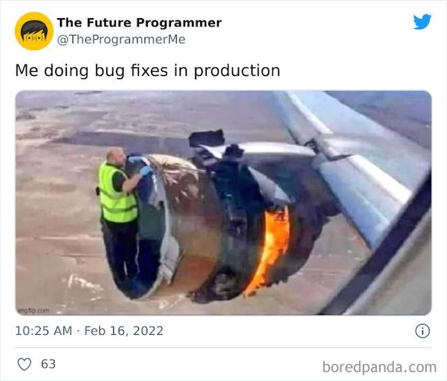

# What to Watch Out For?

When planning and executing an automation project, several potential pitfalls can arise that may undermine your efforts.
Here are key things to watch out for and how to mitigate them:

> Don't let your developers develop the same stack on Windows, Mac and Linux without clear guidelines on how to do it.

> NO!!! Manual changes in production environments. This is a no-go. If you have to do it, you have to automate it.

> Commit without comment or description

> Pull request not reviewed correctly

> Not sufficient communication (deployment without further notice)

> Wrote a PS script without a header or necessary parameters

> Create user stories without description, story points, area and acceptance criteria.

> No defined statement in meetings

> Could, Should, Maybe, Might

> Create undocumented code

> Create unformatted code

> Created a pull request and approved it by yourself

> Pushed to Master without a pull request

> User story not maintained

> Pushed code without pull-request

> Inscrutable commit message

> Tested code only by yourself

> Informed nobody of downtime

> Having no clue about the topic and not asking for information about it

> Not using hard and soft tabs for aligning code

> No documentation

> Documentation not referenced correctly in the Story

> Found a bug but didn’t create a Bug ticket

> Started working on an item without creating a Story

> Started working on an item without informing anybody

> Forgot to make a backup

> Docker registry rate limits can kill your entire deployment pipeline and infrastructure

> Automating an inherently inefficient or broken process

> Lack of clear objectives

> Automating everything indiscriminately

> Using too many different tools

> Resistance to change

> Ignoring Continuous Improvement

> Not having a plan B

> You will never be perfect, but you can try. Every day.

> There is no Fire and Forget

> Cloud and IT architects have no clue about operations

---

## So now what?

### Optimize first, automate second

Avoid automating flawed processes.

### Start small and iterate

Begin with a pilot project and scale based on feedback and measurable success.

### Plan for failure

Build in error handling, logging, and monitoring to ensure you can quickly react to issues.

### Security is key

Never overlook securing automation processes, especially when handling sensitive data.

### Keep improving

Automation is a dynamic process; continuously evaluate and refine your approach.

---

## For Those Affected by This Topic

> We've seen CEOs deciding to implement IaC without having a clue what it means for their staff.

> Not involving every affected team in the delivery chain early will kill your IaC strategy right in the beginning,
> because people naturally tend to block things they might be afraid of.

## The good thing is:

> Nobody Will Loose His job!

It will just be different. Maybe more challenging because of the new technologies, for sure, more interesting because
you get rid of the monotony of your daily manual work, and you will learn a LOT more about IT in general.
