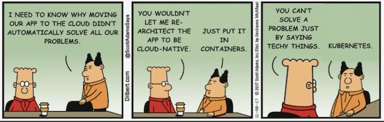

# 2024-e2evc-barcelona-automation-masterclass

In this Masterclass, you will get access to valuable insights and actionable knowledge required to develop and
implement a robust automation strategy for your on-premises and cloud environments.

Time frame: 10:00 - 17:00

Location: Barcelona, Spain

---

## Why do we think we know what we are talking about?

With more than 650.000 lines of code, 350 repositories and more than 8,000 work items in the books,
we will teach you everything you need to know in the following topics and present examples to explain
the most important requirements and concepts.

### We are developing a SaaS app and adjusted our infrastructure over time

#### Version 1

We used available cloud services as much as we can.

#### Version 2

We ran into limits with available cloud services and started migrating some services to Kubernetes.

#### Version 3

We got rid of most cloud-specific services as far as we can to be able to move to any platform we want and be as
independent as we can from the tools and solutions we use.

---

## Agenda

### Introduction

Say something about yourself and your company.

What are you doing?

What are your goals?

Why are you here?

---

### Why should I automate?

Explore and understand the potential and business goals of driving automation adoption.

---

### How to get started?

Master the foundational steps necessary to start your automation journey effectively.

---

### What knowledge do I need?

Understand the core principles for navigating the automation landscape with confidence.

---

### What kind of roles are necessary within a team?

How to define organizational roles and structures that are crucial for an efficient and sustainable automation team.

---

### How to strategically start an automation project?

Learn to orchestrate automation initiatives strategically for maximum impact and efficiency.

### How to design code and Guidelines?

Implement strategies to create scalable and efficient automation solutions. Implement best practices for maintaining consistency and quality in your automation projects and the underlying
code-base.

### Which tools should I use?

Navigate the diverse range of automation tools available, selecting those best aligned with your project
goals.

### How to plan and work on automation projects?

Integrate agile work environments and plan automation projects seamlessly.

---

### What are the components of a complete pipeline?

Understand the key parts of a robust automation pipeline.

---

### How to hand over to operations?

Best practices for transitioning automated processes into operational workflows.

### How to implement security?

Ensure the integrity and resilience of your automation infrastructure through robust security measures.

### What to Watch Out For?

Learn about common pitfalls and how to avoid them when implementing automation projects.

